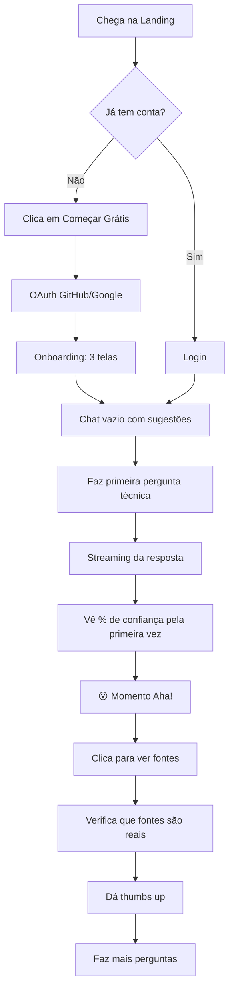
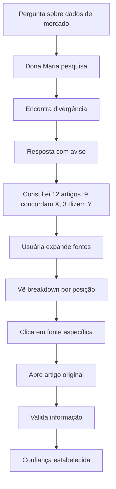
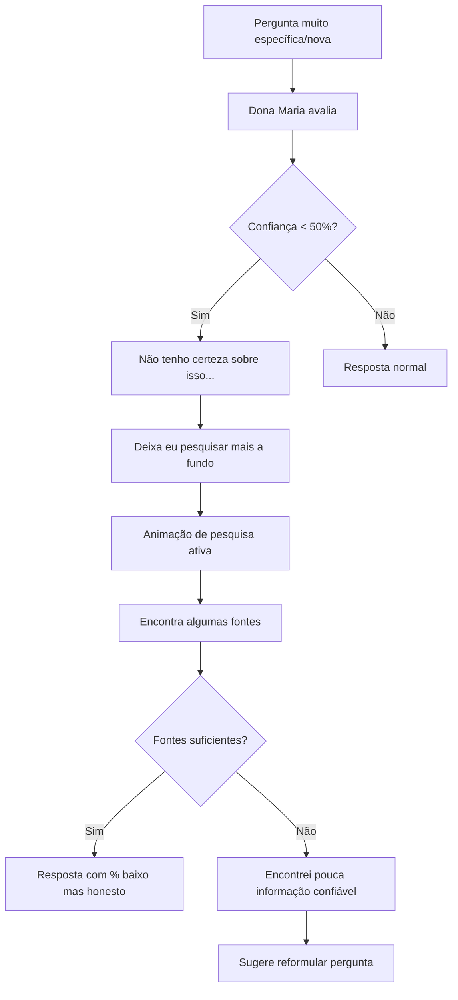
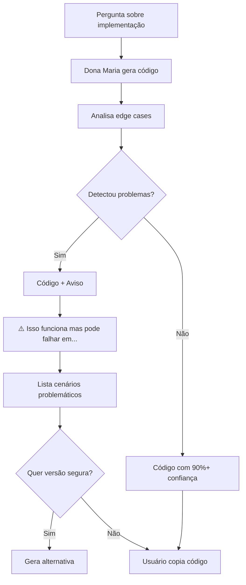

# UX Design Specification — Dona-Maria-IA

**Author:** Raposo  
**Date:** 2026-01-15  
**Version:** 1.0.0

---

## Executive Summary

Este documento define a especificação completa de UX Design para **Dona-Maria-IA** — um Large Language Model revolucionário construído com o princípio de **honestidade radical**. O design prioriza transparência, confiança e clareza, refletindo a proposta única do produto: uma IA que admite quando não sabe, pesquisa ativamente e apresenta grau de confiança estatística em suas respostas.

**Pilares de Design:**

- 🎯 **Transparência Visual** — Confiança comunicada visualmente em cada resposta
- 🔍 **Clareza Informacional** — Fontes e dados sempre acessíveis
- 💚 **Honestidade Empática** — Tom de voz que admite limitações sem perder autoridade
- ⚡ **Eficiência Focada** — Fluxos otimizados para desenvolvedores e pesquisadores

---

## Project Understanding

### Visão do Produto

Dona-Maria-IA quebra o paradigma de IAs que "alucinam" informações. Enquanto IAs atuais apresentam incertezas como fatos, Dona Maria:

1. **Admite quando não sabe** — Diz "não sei, deixa eu pesquisar"
2. **Pesquisa ativamente** — Consulta múltiplas fontes em tempo real
3. **Mostra confiança estatística** — "87% de certeza baseado em 12 fontes"
4. **Especializa em código** — Sugestões de alta qualidade para devs

### Target Users

| Persona                             | Descrição                         | Dor Principal                                                          |
| ----------------------------------- | --------------------------------- | ---------------------------------------------------------------------- |
| **Dev Duvidoso (Carlos)**           | Desenvolvedor 28 anos, Full-Stack | "Gastei 2h debugando código que a IA jurou que funcionava"             |
| **Pesquisadora Paranoica (Marina)** | Analista de Dados, 35 anos        | "Passei vergonha com dados inventados pela IA"                         |
| **Tech Lead (Rafael)**              | Líder técnico, 42 anos            | "Bugs sutis passam pelo code review porque o time confia demais na IA" |
| **Estudante (Juliana)**             | Estudante de CC, 22 anos          | "Não tenho experiência para saber quando a IA está errada"             |

### UX Design Challenges

1. **Comunicar incerteza sem parecer incompetente** — Como dizer "não sei" de forma que inspire confiança?
2. **Apresentar múltiplas fontes sem sobrecarregar** — Como mostrar 12 fontes sem virar um relatório?
3. **Streaming com transparência** — Como mostrar % de confiança em tempo real?
4. **Diferenciação visual** — Como parecer único sem ser bizarro?

---

## Core Experience Definition

### Core User Action

> **"Fazer uma pergunta e receber uma resposta CONFIÁVEL com fontes verificáveis"**

Esta é a interação que define Dona Maria. Se acertarmos isso, todo o resto segue.

### Experience Principles

| Princípio                 | Descrição                        | Implicação UX                               |
| ------------------------- | -------------------------------- | ------------------------------------------- |
| **Transparência Radical** | Nada é escondido do usuário      | Confiança visível, fontes acessíveis        |
| **Honestidade Empática**  | Admitir limitações com gentileza | Tom de voz humilde mas competente           |
| **Eficiência Informada**  | Economizar tempo do usuário      | Respostas diretas com profundidade opcional |
| **Progressividade**       | Detalhes sob demanda             | Interface limpa com drill-down disponível   |

### Platform Requirements

- **Plataforma:** Web App (SPA com SSR para landing)
- **Dispositivos:** Desktop-first, mobile-friendly
- **Input:** Primariamente teclado (devs), touch secundário
- **Browsers:** Chrome, Firefox, Safari, Edge (últimas 2 versões)

### Effortless Interactions

| Interação       | Deve ser Effortless                  |
| --------------- | ------------------------------------ |
| Enviar pergunta | Enter para enviar, sem fricção       |
| Ver confiança   | Visível instantaneamente, sem clique |
| Acessar fontes  | Um clique para expandir              |
| Copiar código   | Botão de cópia em cada bloco         |
| Dar feedback    | Thumbs up/down visível e rápido      |

---

## Desired Emotional Response

### Emotional Journey

| Momento                    | Emoção Desejada           | Como Alcançar                         |
| -------------------------- | ------------------------- | ------------------------------------- |
| **Primeira visita**        | Curiosidade + Intriga     | "Uma IA que admite não saber?"        |
| **Primeira pergunta**      | Surpresa + Satisfação     | Ver % de confiança pela primeira vez  |
| **Resposta com "não sei"** | Respeito + Confiança      | "Finalmente, uma IA honesta"          |
| **Verificar fontes**       | Segurança + Empoderamento | Fontes reais, clicáveis, verificáveis |
| **Uso diário**             | Confiança + Eficiência    | Ferramenta indispensável              |

### Micro-Emotions

```
✅ BUSCAR                    ❌ EVITAR
─────────────────────────────────────────
Confiança                    Dúvida
Clareza                      Confusão
Empoderamento                Dependência
Surpresa Positiva            Frustração
Respeito                     Ceticismo
Eficiência                   Ansiedade
```

### Emotional Design Decisions

| Decisão                   | Emoção Suportada              |
| ------------------------- | ----------------------------- |
| Barra de confiança visual | Segurança, Transparência      |
| Cor verde menta (#aeffde) | Frescor, Honestidade, Clareza |
| Fontes expandíveis        | Controle, Empoderamento       |
| Admissão de incerteza     | Respeito, Confiança           |
| Streaming progressivo     | Engajamento, Antecipação      |

---

## UX Pattern Analysis & Inspiration

### Inspiring Products

| App               | O que faz bem            | Aplicação em Dona Maria                   |
| ----------------- | ------------------------ | ----------------------------------------- |
| **Perplexity AI** | Citação de fontes inline | Adaptar para mostrar consenso/divergência |
| **Linear**        | Design limpo e eficiente | Interface focada sem distrações           |
| **Notion**        | Hierarquia visual clara  | Organização de conversas                  |
| **VS Code**       | Experiência de dev       | Blocos de código com syntax highlight     |
| **Stripe Docs**   | Clareza informacional    | Documentação da metodologia de confiança  |

### Transferable Patterns

**De Perplexity:**

- Fontes numeradas inline [1][2][3]
- Painel lateral de referências
- Streaming de resposta com fontes

**De Linear:**

- Shortcuts de teclado (devs amam)
- Densidade informacional balanceada
- Dark mode como padrão

**De VS Code:**

- Syntax highlighting em blocos de código
- Botão de cópia sempre visível
- Suporte a múltiplas linguagens

---

## Design System Choice

### Decision: Tailwind CSS + Headless UI + Custom Components

**Razão:**

- **Flexibilidade** — Tema totalmente customizável para identidade única
- **Performance** — CSS atomic para carregamento rápido
- **Acessibilidade** — Headless UI com ARIA built-in
- **Developer Experience** — Time de dev confortável com Tailwind

### Design Tokens

```css
/* Colors - Tema Raposo */
--color-base: #333333; /* Cinza escuro - backgrounds, texto */
--color-primary: #aeffde; /* Verde menta - destaques, sucesso */
--color-secondary: #e4f1ff; /* Azul claro - informações, links */

/* Semantic Colors */
--color-confidence-high: #aeffde; /* 80-100% confiança */
--color-confidence-medium: #ffd966; /* 50-79% confiança */
--color-confidence-low: #ff8080; /* 0-49% confiança */

--color-success: #aeffde;
--color-warning: #ffd966;
--color-error: #ff8080;
--color-info: #e4f1ff;

/* Typography */
--font-primary: 'Inter', sans-serif;
--font-mono: 'JetBrains Mono', monospace;

/* Spacing (8px base) */
--space-1: 0.25rem; /* 4px */
--space-2: 0.5rem; /* 8px */
--space-3: 0.75rem; /* 12px */
--space-4: 1rem; /* 16px */
--space-6: 1.5rem; /* 24px */
--space-8: 2rem; /* 32px */
--space-12: 3rem; /* 48px */
```

---

## Defining Core Experience

### The Defining Interaction

> **"Dona Maria responde: 'Tenho 73% de certeza baseado em 8 fontes...'"**

Este é o momento "Aha!" que os usuários vão contar para amigos. A visualização da confiança é o diferencial visual que nenhum concorrente tem.

### Confidence Display System

```
┌─────────────────────────────────────────────────────────────┐
│  [████████████████████░░░░░░] 73% de confiança              │
│  📚 Baseado em 8 fontes · 6 concordam · 2 divergem          │
└─────────────────────────────────────────────────────────────┘
```

**Estados de Confiança:**

| Nível              | Visual                         | Comportamento                              |
| ------------------ | ------------------------------ | ------------------------------------------ |
| **Alto (80-100%)** | Barra verde (#aeffde), check ✓ | Resposta direta                            |
| **Médio (50-79%)** | Barra amarela, ⚠️              | "Baseado em X fontes, mas..."              |
| **Baixo (<50%)**   | Barra vermelha, 🔍             | "Não tenho certeza, deixa eu pesquisar..." |
| **Pesquisando**    | Animação de loading            | "Consultando fontes..."                    |

### Success Criteria for Core Experience

- [ ] Usuário vê % de confiança em <1 segundo após resposta
- [ ] Fontes são acessíveis em 1 clique
- [ ] Divergências são claramente indicadas
- [ ] "Não sei" é comunicado com dignidade
- [ ] Streaming mostra confiança progressivamente

---

## Visual Design Foundation

### Color System

**Tema Principal (Especificado por Raposo):**

| Token       | Hex     | Uso                                      |
| ----------- | ------- | ---------------------------------------- |
| `base`      | #333333 | Background escuro, texto em light mode   |
| `primary`   | #aeffde | CTAs, confiança alta, sucesso, destaques |
| `secondary` | #e4f1ff | Links, informações, hover states         |

**Paleta Expandida:**

```
Background Dark:    #1a1a1a (mais escuro que base)
Background Card:    #2a2a2a (cards e superfícies)
Text Primary:       #ffffff (texto principal)
Text Secondary:     #a0a0a0 (texto auxiliar)
Text Muted:         #666666 (texto desabilitado)

Primary Light:      #d4ffef (hover do primary)
Primary Dark:       #7ad4b5 (pressed do primary)

Secondary Light:    #f0f7ff (hover do secondary)
Secondary Dark:     #b8d4f0 (pressed do secondary)
```

### Typography System

**Font Stack:**

```css
/* Headings e UI */
font-family: 'Inter', -apple-system, BlinkMacSystemFont, sans-serif;

/* Código */
font-family: 'JetBrains Mono', 'Fira Code', monospace;
```

**Type Scale:**

| Token     | Size            | Weight | Line Height | Uso               |
| --------- | --------------- | ------ | ----------- | ----------------- |
| `display` | 3rem (48px)     | 700    | 1.1         | Landing hero      |
| `h1`      | 2rem (32px)     | 600    | 1.2         | Títulos de página |
| `h2`      | 1.5rem (24px)   | 600    | 1.3         | Seções            |
| `h3`      | 1.25rem (20px)  | 500    | 1.4         | Subseções         |
| `body`    | 1rem (16px)     | 400    | 1.6         | Texto corrido     |
| `small`   | 0.875rem (14px) | 400    | 1.5         | Labels, captions  |
| `code`    | 0.875rem (14px) | 400    | 1.6         | Blocos de código  |

### Spacing & Layout

**Grid System:**

- Container max-width: 1200px
- Sidebar: 280px (conversas)
- Main content: flex-grow
- Gutter: 24px

**Spacing Scale (8px base):**

- `xs`: 4px — gaps mínimos
- `sm`: 8px — padding interno
- `md`: 16px — margin entre elementos
- `lg`: 24px — seções
- `xl`: 32px — áreas principais
- `2xl`: 48px — hero sections

---

## Design Direction Decision

### Chosen Direction: "Transparent Intelligence"

**Conceito Visual:**
Uma interface que comunica inteligência através de transparência — literalmente e figurativamente. O dark mode com acentos em verde menta (#aeffde) evoca terminais de computador clássicos com um twist moderno, sugerindo tanto competência técnica quanto frescor/honestidade.

**Características Visuais:**

1. **Dark Mode Dominante** — Conforto para devs, foco no conteúdo
2. **Verde Menta como Herói** — Cor única que diferencia da concorrência
3. **Glassmorphism Sutil** — Cards com leve transparência
4. **Gradientes Sutis** — Verde para azul em elementos de destaque
5. **Iconografia Minimal** — Ícones line-art, sem ruído visual

**Layout Principal:**

```
┌──────────────────────────────────────────────────────────────┐
│ 🏠 Dona Maria                               [Perfil] [Tema]  │
├────────────────┬─────────────────────────────────────────────┤
│                │                                             │
│  📁 Conversas  │     ┌─────────────────────────────────┐    │
│                │     │                                 │    │
│  + Nova        │     │   Área de Chat Principal        │    │
│                │     │                                 │    │
│  □ Ontem       │     │   [Mensagem com confiança]     │    │
│  □ Semana      │     │   [████████░░] 73%             │    │
│  □ Mês         │     │                                 │    │
│                │     │   [Resposta com fontes]         │    │
│                │     │                                 │    │
│                │     └─────────────────────────────────┘    │
│                │                                             │
│                │  ┌─────────────────────────────────────┐   │
│                │  │ Pergunte qualquer coisa...    [↵]  │   │
│                │  └─────────────────────────────────────┘   │
└────────────────┴─────────────────────────────────────────────┘
```

---

## User Journey Flows

### Journey 1: Dev Duvidoso — Primeiro Uso



### Journey 2: Pesquisadora — Resposta com Divergência



### Journey 3: Resposta "Não Sei"



### Journey 4: Código com Edge Cases



---

## Component Strategy

### Core Components

#### 1. ConfidenceBar

```
Propósito: Visualizar % de confiança em cada resposta
Estados: filling (animado), low (<50%), medium (50-79%), high (80-100%)
Variantes: inline (dentro do texto), block (destacado)

┌────────────────────────────────────────┐
│ [████████████████░░░░░░] 73%           │
│ 📚 8 fontes · 6 concordam              │
└────────────────────────────────────────┘
```

#### 2. SourcePanel

```
Propósito: Mostrar fontes consultadas com detalhes
Estados: collapsed, expanded, loading
Ações: expandir, colapsar, abrir link externo

┌────────────────────────────────────────┐
│ 📚 Fontes Consultadas                  │
├────────────────────────────────────────┤
│ ✓ [1] Stack Overflow - 2024           │
│ ✓ [2] MDN Web Docs - Oficial          │
│ ⚠ [3] Dev.to - Diverge nos dados      │
│   [Ver todas as 8 fontes →]           │
└────────────────────────────────────────┘
```

#### 3. ChatMessage

````
Propósito: Container para mensagens do usuário e da IA
Estados: sending, streaming, complete, error
Variantes: user, assistant, system

┌────────────────────────────────────────┐
│ 🧑 Você                        14:32   │
│ Como otimizar queries PostgreSQL?      │
└────────────────────────────────────────┘

┌────────────────────────────────────────┐
│ 🤖 Dona Maria          [73%] [📚 8]    │
│ Para otimizar queries PostgreSQL...    │
│ ```sql                                 │
│ EXPLAIN ANALYZE SELECT...              │
│ ```                        [📋 Copiar] │
│ [👍] [👎] [🔗 Compartilhar]            │
└────────────────────────────────────────┘
````

#### 4. CodeBlock

```
Propósito: Exibir código com syntax highlighting
Estados: default, copied, error-highlighted
Ações: copiar, reportar erro, expandir

┌────────────────────────────────────────┐
│ python                    [📋 Copiar]  │
├────────────────────────────────────────┤
│ def optimize_query(conn):              │
│     cursor = conn.cursor()             │
│     cursor.execute("EXPLAIN...")       │
└────────────────────────────────────────┘
```

#### 5. ResearchStatus

```
Propósito: Mostrar quando Dona Maria está pesquisando
Estados: idle, searching, found, failed

┌────────────────────────────────────────┐
│ 🔍 Pesquisando...                      │
│ ├─ ✓ Stack Overflow                    │
│ ├─ ✓ GitHub Discussions                │
│ ├─ ⏳ MDN Web Docs                     │
│ └─ ⏳ Dev.to                           │
│ 3 de 5 fontes consultadas              │
└────────────────────────────────────────┘
```

#### 6. UncertaintyBanner

```
Propósito: Destacar quando Dona Maria admite não saber
Estados: uncertain, researching, partial-answer

┌────────────────────────────────────────┐
│ 💭 Hmm, não tenho certeza sobre isso.  │
│ Deixa eu pesquisar mais a fundo...     │
│                                        │
│ [🔍 Pesquisando fontes adicionais]     │
└────────────────────────────────────────┘
```

### Component Hierarchy

```
App
├── Layout
│   ├── Sidebar
│   │   ├── Logo
│   │   ├── NewChatButton
│   │   ├── ConversationList
│   │   │   └── ConversationItem
│   │   └── UserMenu
│   └── MainContent
│       ├── ChatHeader
│       ├── MessageList
│       │   ├── ChatMessage
│       │   │   ├── ConfidenceBar
│       │   │   ├── SourcePanel
│       │   │   ├── CodeBlock
│       │   │   └── FeedbackButtons
│       │   └── ResearchStatus
│       └── ChatInput
│           ├── TextArea
│           └── SendButton
└── Modals
    ├── SettingsModal
    ├── SourceDetailModal
    └── ShareModal
```

---

## UX Consistency Patterns

### Button Hierarchy

| Tipo          | Uso                            | Visual                     |
| ------------- | ------------------------------ | -------------------------- |
| **Primary**   | Ação principal (Enviar, Criar) | Verde (#aeffde), bold      |
| **Secondary** | Ações secundárias              | Outline, borda #aeffde     |
| **Ghost**     | Ações terciárias               | Texto apenas, hover subtle |
| **Danger**    | Ações destrutivas              | Vermelho (#ff8080)         |

### Feedback Patterns

| Situação    | Pattern                                  |
| ----------- | ---------------------------------------- |
| **Sucesso** | Toast verde + ícone ✓, auto-dismiss 3s   |
| **Erro**    | Toast vermelho + ícone ✗, requer dismiss |
| **Info**    | Toast azul (#e4f1ff), auto-dismiss 5s    |
| **Warning** | Toast amarelo, persiste até ação         |
| **Loading** | Skeleton + spinner contextual            |

### Form Patterns

- **Validação:** Inline, em tempo real
- **Erros:** Abaixo do campo, vermelho
- **Labels:** Sempre visíveis, acima do campo
- **Placeholders:** Exemplos, não instruções
- **Submit:** Disabled até válido

### Navigation Patterns

- **Sidebar:** Sempre visível em desktop, drawer em mobile
- **Breadcrumbs:** Não necessário (estrutura flat)
- **Back:** Não necessário (SPA com sidebar)
- **Keyboard:** Ctrl+N nova conversa, Ctrl+K busca, Enter enviar

### Empty States

| Contexto             | Mensagem                                             | Ação                  |
| -------------------- | ---------------------------------------------------- | --------------------- |
| Primeira visita      | "Olá! Sou a Dona Maria. Faça sua primeira pergunta!" | Sugestões de prompts  |
| Sem conversas        | "Nenhuma conversa ainda"                             | Botão "Nova Conversa" |
| Busca sem resultados | "Nenhuma conversa encontrada"                        | "Limpar filtros"      |
| Erro de rede         | "Ops! Parece que a conexão caiu"                     | "Tentar novamente"    |

### Loading States

| Contexto             | Pattern                            |
| -------------------- | ---------------------------------- |
| Página inicial       | Skeleton da sidebar + área de chat |
| Enviando mensagem    | Bolha com "..." animado            |
| Recebendo resposta   | Streaming progressivo              |
| Pesquisando fontes   | ResearchStatus com progresso       |
| Carregando histórico | Skeleton de mensagens              |

---

## Responsive Design & Accessibility

### Breakpoint Strategy

| Breakpoint  | Largura        | Layout                               |
| ----------- | -------------- | ------------------------------------ |
| **Mobile**  | < 768px        | Drawer sidebar, input fixo no bottom |
| **Tablet**  | 768px - 1023px | Sidebar colapsável, layout adaptado  |
| **Desktop** | ≥ 1024px       | Sidebar fixa, layout completo        |

### Mobile-Specific Adaptations

```
Mobile Layout:
┌──────────────────────────┐
│ ☰ Dona Maria      [👤]   │  ← Header com menu hambúrguer
├──────────────────────────┤
│                          │
│   Área de Chat           │
│   (scroll vertical)      │
│                          │
│   [Mensagem]             │
│   [Resposta + %]         │
│                          │
├──────────────────────────┤
│ [Pergunte...]      [↵]   │  ← Input fixo no bottom
└──────────────────────────┘
```

**Adaptações Mobile:**

- Sidebar vira drawer (swipe ou tap no hambúrguer)
- ConfidenceBar simplificado (apenas %)
- SourcePanel inicia colapsado
- CodeBlock com scroll horizontal
- Botões de ação maiores (44x44px mínimo)

### Accessibility Compliance (WCAG 2.1 AA)

**Contraste de Cores:**

| Combinação         | Ratio  | Status |
| ------------------ | ------ | ------ |
| #ffffff em #333333 | 12.6:1 | ✅ AAA |
| #aeffde em #333333 | 11.2:1 | ✅ AAA |
| #333333 em #aeffde | 11.2:1 | ✅ AAA |
| #e4f1ff em #333333 | 12.1:1 | ✅ AAA |

**Keyboard Navigation:**

| Ação            | Atalho               |
| --------------- | -------------------- |
| Nova conversa   | Ctrl/Cmd + N         |
| Buscar          | Ctrl/Cmd + K         |
| Enviar mensagem | Enter                |
| Nova linha      | Shift + Enter        |
| Copiar código   | Click ou Tab + Enter |
| Fechar modal    | Escape               |

**Screen Reader Support:**

- Todas as imagens com alt text descritivo
- Landmarks semânticos (main, nav, aside)
- ARIA labels em componentes interativos
- Live regions para atualizações de streaming
- Skip links para navegação rápida

**Focus Management:**

- Focus visível com outline verde (#aeffde)
- Focus trap em modais
- Focus restaurado após fechar modal
- Tab order lógico

---

## Implementation Guidelines

### Development Priorities

**Fase 1 — Core (MVP):**

1. ChatInput + ChatMessage
2. ConfidenceBar
3. SourcePanel (básico)
4. Sidebar + ConversationList

**Fase 2 — Refinamento:**

1. CodeBlock com syntax highlight
2. ResearchStatus com progresso
3. UncertaintyBanner
4. Feedback (thumbs up/down)

**Fase 3 — Polish:**

1. Animações e transições
2. Keyboard shortcuts
3. Dark/Light mode toggle
4. Exportação de conversas

### Technical Recommendations

**Frontend Stack:**

- Next.js 14+ (App Router)
- Tailwind CSS
- Headless UI / Radix UI
- Framer Motion (animações)
- Prism.js (syntax highlight)

**Performance:**

- Streaming via Server-Sent Events
- Skeleton loading
- Code splitting por rota
- Image optimization via Next/Image

---

## Appendix

### Design Assets

- **Color Themes Visualizer:** `ux-color-themes.html`
- **Design Directions Mockups:** `ux-design-directions.html`

### References

- [PRD - Dona-Maria-IA](prd.md)
- [Product Brief](product-brief-Dona-Maria-IA-2026-01-15.md)

### Next Steps

1. **Wireframes detalhados** — Criar wireframes em Excalidraw
2. **Protótipo interativo** — Figma ou código HTML
3. **Arquitetura técnica** — Definir stack e infraestrutura
4. **User testing** — Validar fluxos com usuários reais

---

**FIM DO DOCUMENTO**
